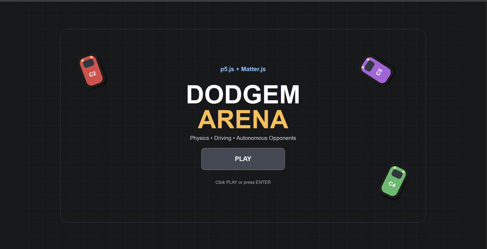
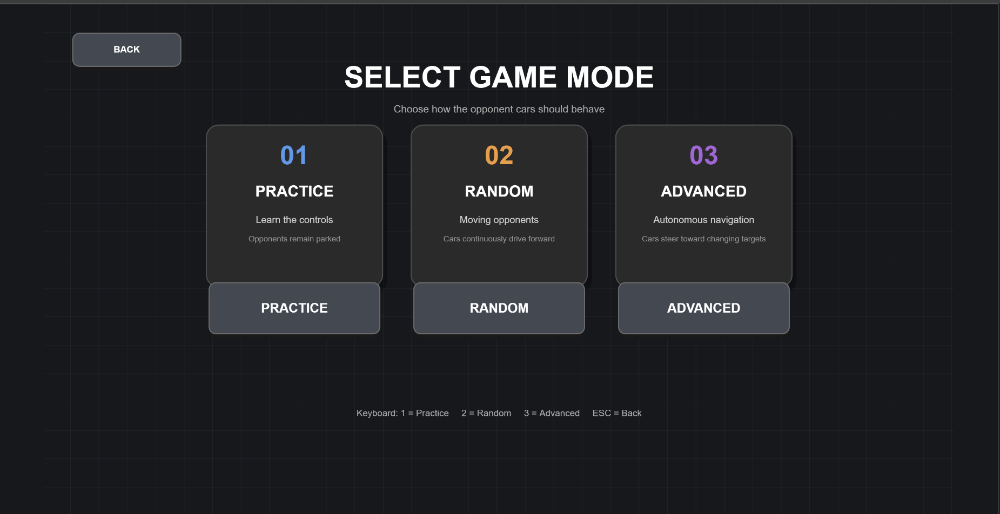
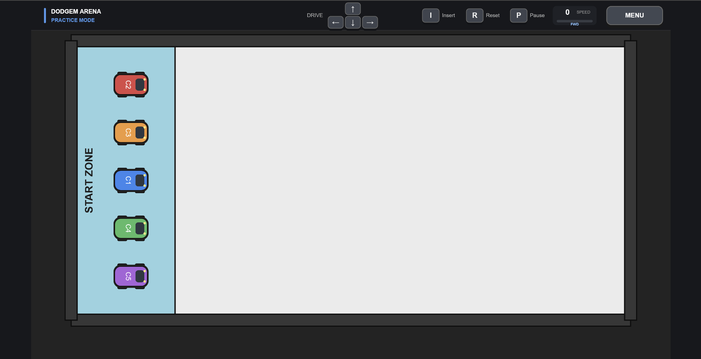
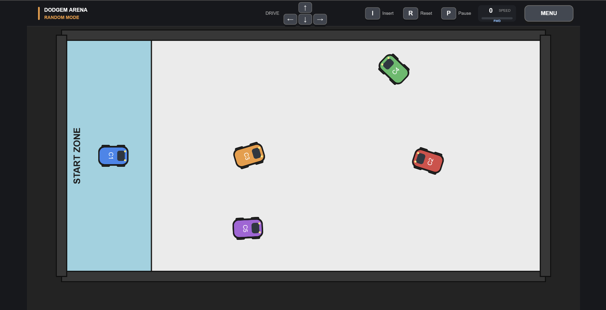
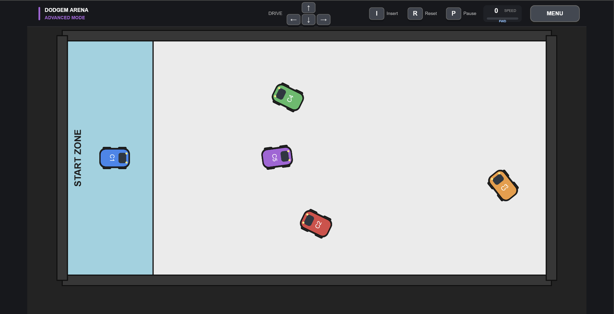

# Dodgem Arena

An experimental browser-based dodgem-car simulation built with **p5.js**, **Matter.js**, and **p5.sound**.

> **Project status:** Experimental / Work in Progress  
> **Purpose:** Exploration, experimentation, and independent learning



## Live Demo

**Play Dodgem Arena:** [Launch the live simulation](https://github.com/ngclara07/dodgem_arena_p5js.git)

> **Controls:** Arrow keys to drive · `I` to insert · `R` to restart · `P` to pause

---

## Overview

Dodgem Arena is a small interactive simulation developed as an environment for experimenting with browser-based graphics, 2D rigid-body physics, game-state architecture, autonomous vehicle behaviour, collision feedback, and procedural sound.

The project began as a relatively simple physics-based driving environment and has gradually evolved through several development phases.

Rather than treating the project as a finished commercial game, the objective is to use it as a technical sandbox for exploring how different systems interact:

- rendering
- physics
- user input
- game states
- autonomous agents
- collision events
- visual effects
- audio feedback
- interface design

The current implementation provides three gameplay modes with progressively different opponent behaviour:

- **Practice** — opponents remain parked
- **Random** — opponents continuously drive forward
- **Advanced** — opponents autonomously navigate toward changing targets

---

## Technologies

The project currently uses:

### p5.js

p5.js provides the primary rendering and interaction environment.

It is responsible for:

- canvas creation
- drawing
- animation
- keyboard input
- mouse input
- colours
- text rendering
- interface elements
- visual effects

### Matter.js

Matter.js provides the rigid-body physics simulation.

It is responsible for:

- car physics bodies
- arena walls
- velocity
- angular velocity
- forces
- collisions
- restitution
- friction
- collision events

The simulation is configured as a top-down environment, so gravitational acceleration is disabled.

### p5.sound

p5.sound is used for runtime-generated audio.

The current project does not require external MP3 or WAV assets.

Instead, sound effects are synthesised programmatically using oscillators.

Audio feedback currently includes:

- countdown tones
- GO confirmation tone
- car-to-car impact sounds
- car-to-wall impact sounds

Collision sound characteristics vary according to impact strength.

---

## Project Structure

The repository currently uses the following structure:

```text
dodgem_arena_p5js/
│
├── screenshots/
│   ├── advanced-mode.png
│   ├── mode-selection.png
│   ├── practice-mode.png
│   ├── random-mode.png
│   └── start-screen.png
│
├── index.html
├── matter.min.js
├── p5.min.js
├── p5.sound.min.js
├── README.md
└── sketch.js
```

### `index.html`

Provides the browser entry point and loads the required JavaScript libraries.

The dependency order is important:

```text
p5.js
  ↓
p5.sound
  ↓
Matter.js
  ↓
sketch.js
```

### `sketch.js`

Contains the main simulation implementation, including:

- game-state management
- UI
- arena construction
- car classes
- opponent behaviour
- collision handling
- visual effects
- HUD
- speedometer
- sound system

### `screenshots/`

Contains screenshots documenting the current user interface and the three gameplay modes.

---

# Current Features

## Game-State Architecture

The application is organised around explicit states:

```text
START
  │
  ▼
MODE SELECT
  │
  ▼
COUNTDOWN
  │
  ▼
PLAYING
  │
  ▼
PAUSED
```

The current states are:

```text
STATE_START
STATE_MODE_SELECT
STATE_COUNTDOWN
STATE_PLAYING
STATE_PAUSED
```

This separates menu behaviour, countdown behaviour, active simulation, and pause behaviour rather than attempting to manage everything inside one gameplay loop.

---

## Start Screen

The application opens with an animated start screen containing:

- project title
- decorative moving cars
- PLAY button
- animated background
- keyboard shortcut support

The user can continue using either the mouse or the ENTER key.

---

## Mode Selection

Three modes are currently available.



### 1. Practice Mode

Practice Mode is intended for learning the vehicle controls and observing the physics environment.

Opponent vehicles remain parked.

This makes it easier to experiment with:

- acceleration
- reversing
- steering
- collision response
- wall interaction
- vehicle insertion

### 2. Random Mode

Random Mode introduces moving opponents.

Opponent vehicles continuously apply forward throttle.

Unlike Advanced Mode, these vehicles do not perform target-based navigation.

This produces a more dynamic environment while retaining relatively simple autonomous behaviour.

### 3. Advanced Mode

Advanced Mode introduces autonomous target-based navigation.

Each opponent:

1. selects a target position within the arena
2. calculates the direction toward that target
3. determines the required heading
4. compares the target heading with its current orientation
5. steers toward the target
6. applies throttle
7. selects another target when required

Targets are replaced when:

- the vehicle approaches the current target, or
- the target timer expires

This provides the foundation for more sophisticated autonomous navigation experiments planned for later development.

---

# Vehicle Physics

Cars are represented using Matter.js rectangular rigid bodies.

Each vehicle has properties including:

- position
- orientation
- velocity
- angular velocity
- density
- restitution
- friction
- air resistance

Forward motion is generated using forces rather than directly translating the vehicle across the canvas.

A forward vector is calculated from the vehicle's current orientation:

```text
vehicle orientation
       │
       ▼
 forward vector
       │
       ▼
 applied force
       │
       ▼
 Matter.js physics
       │
       ▼
 vehicle movement
```

This allows acceleration and collisions to remain part of the same physical simulation.

---

## Longitudinal Speed

The project distinguishes between total rigid-body velocity and forward vehicle speed.

Forward speed is calculated by projecting the vehicle's velocity onto its forward vector.

Conceptually:

```text
forward speed = velocity · forward direction
```

This is particularly useful for the speedometer because sideways velocity caused by collisions should not necessarily be interpreted as forward driving speed.

---

## Speed Limiting

Forward and reverse speeds are limited independently.

The implementation preserves lateral velocity while constraining the longitudinal component.

This is important during collisions because simply limiting the total velocity vector could remove sideways momentum generated by the physics simulation.

---

# Controls

## Driving

| Key | Action |
| --- | --- |
| ↑ | Accelerate |
| ↓ | Reverse |
| ← | Steer left |
| → | Steer right |

## Game Controls

| Key | Action |
| --- | --- |
| `I` | Arm player insertion |
| `R` | Restart current mode |
| `P` | Pause / resume |
| `ESC` | Pause / return depending on state |
| `1` | Practice Mode |
| `2` | Random Mode |
| `3` | Advanced Mode |
| `ENTER` | Continue from start screen |

Mouse interaction is also supported for menu buttons and vehicle insertion.

---

# Player Insertion

The player vehicle can be repositioned inside the designated START ZONE.

The insertion system performs validation before moving the vehicle.

A requested insertion must:

- occur inside the START ZONE
- respect vehicle dimensions
- avoid overlapping opponent vehicles

The player vehicle's velocity, angular velocity, force, torque, and trail are reset after a valid insertion.

---

# Countdown System

Starting or restarting a game mode produces a:

```text
3
↓
2
↓
1
↓
GO!
```

countdown.

The countdown is implemented as a separate application state rather than running simultaneously with active gameplay.

The physics scene remains visible while the countdown occurs, but the simulation itself remains frozen.

Audio is synchronised with countdown stages.

A stage-tracking variable prevents the sound from being triggered on every rendered frame.

---

# Pause System

Active gameplay can be paused using:

```text
P
```

or:

```text
ESC
```

The pause interface provides:

- Resume
- Restart
- Main Menu

While paused, the current game scene remains visible behind a translucent overlay.

The physics simulation is not advanced until gameplay resumes.

---

# HUD

The gameplay HUD displays information and controls independently from the world layer.

It includes:

- game title
- current mode
- keyboard indicators
- insertion control
- restart control
- pause control
- speedometer
- menu button

Keyboard indicators visually react when their corresponding keys are pressed.

---

# Speedometer

Phase 3 introduced a player speedometer.

The displayed value is an arcade-style representation rather than a calibrated physical measurement.

It is derived from the player's longitudinal velocity and converted using a display multiplier.

This means sideways motion caused by collisions does not incorrectly produce a large forward-speed reading.

---

# Motion Trails

Vehicles generate fading rear-wheel trails while moving.

Instead of producing a single trail from the centre of the vehicle, the current implementation approximates separate rear-left and rear-right tyre positions.

Conceptually:

```text
        FRONT
          ↑

      ┌────────┐
      │  CAR   │
      │        │
      └────────┘

       •      •
       │      │
       │      │
       ▼      ▼

      tyre trails
```

Trail points gradually lose opacity and are eventually removed.

A maximum number of trail points is maintained to prevent indefinite memory growth.

---

# Collision System

Matter.js collision events are used to detect interactions between:

- car and car
- car and arena wall

Collision events feed several feedback systems.

For example:

```text
       PHYSICAL COLLISION
               │
               ▼
        impact strength
               │
       ┌───────┼───────┐
       ▼       ▼       ▼
   particles  shake   sound
```

This allows multiple presentation systems to respond to the same underlying physical event.

---

# Collision Particles

Vehicle impacts produce directional particle bursts.

Particle behaviour depends partly on collision strength.

The particle system includes:

- position
- velocity
- colour
- lifetime
- directional emission

Particles are intentionally implemented as visual objects rather than Matter.js physics bodies.

This keeps temporary visual effects separate from the rigid-body simulation.

The total number of collision particles is bounded to avoid uncontrolled growth.

---

# Screen Shake

Significant collisions generate temporary screen shake.

The shake magnitude depends on impact strength.

Only the world rendering layer is displaced.

The HUD remains stable.

Conceptually:

```text
Canvas
│
├── World layer
│   ├── arena
│   ├── cars
│   ├── trails
│   └── collision effects
│
│      ↑ affected by screen shake
│
└── HUD layer
    ├── controls
    ├── speedometer
    └── menu

       ↑ remains stable
```

This separation prevents interface elements from becoming difficult to read during collisions.

---

# Procedural Sound

Phase 3 introduces synthesised sound effects.

No external audio assets are required.

The sound system currently generates:

- countdown beeps
- GO tones
- car collision sounds
- wall collision sounds

The implementation uses `p5.Oscillator` to generate tones at runtime.

Amplitude changes are performed directly through oscillator amplitude ramps.

The sound subsystem is deliberately treated as optional.

Its design follows the principle:

```text
SOUND FAILURE != GAME FAILURE
```

Audio operations are therefore protected so that an audio-related runtime problem should not terminate the main p5.js rendering loop.

---

## Browser Audio Restrictions

Modern browsers generally require a user interaction before audio playback is permitted.

The application therefore attempts to unlock audio after keyboard or mouse interaction.

Audio initialisation is protected by error handling so that gameplay can continue even when browser audio is unavailable.

---

# Opponent Collision Behaviour

Opponent vehicles have simple responses to collisions.

## Barrier Collision

When an opponent collides with a wall, it changes orientation and temporarily enters a collision cooldown.

## Vehicle Collision

When an opponent collides with another vehicle, it performs a directional turn.

Collision cooldowns help prevent the same opponent from repeatedly applying collision-response logic over consecutive frames.

These behaviours are intentionally simple and are expected to evolve during later AI experiments.

---

# Development Phases

The project has been developed incrementally.

## Phase 1 — UI Architecture

Phase 1 established the application structure.

Implemented features included:

- start screen
- application-state system
- mode-selection screen
- reusable pseudo-3D buttons
- mouse interaction
- keyboard menu interaction

The primary objective was to move from a single simulation screen toward a structured interactive application.

---

## Phase 2 — Interaction Feedback

Phase 2 concentrated on interaction and usability.

Implemented features included:

- 3 → 2 → 1 → GO countdown
- pause system
- restart system
- keyboard indicators
- improved HUD
- mode indicator
- pause overlay

This phase made the simulation easier to operate and made the current application state more visible to the user.

---

## Phase 3 — Game Feel

Phase 3 concentrated on feedback and responsiveness.

Implemented features include:

- directional collision particles
- collision-dependent screen shake
- player speedometer
- improved dual-wheel trails
- stronger collision feedback
- synthesised sound effects

The objective was to investigate how relatively small presentation systems can make physical interactions easier to perceive.

---

## Phase 4 — Autonomous Behaviour and Technical Extension

Phase 4 is planned as a deeper exploration of autonomous vehicle behaviour.

Potential areas include:

- AI debug mode
- sensor visualisation
- obstacle sensing
- collision avoidance
- static obstacles
- improved target selection
- steering decisions
- local navigation
- more sophisticated autonomous behaviour

A likely progression is:

```text
Current target navigation
          │
          ▼
     Debug display
          │
          ▼
      Sensor rays
          │
          ▼
   Obstacle detection
          │
          ▼
  Collision avoidance
          │
          ▼
 Target + avoidance steering
          │
          ▼
More sophisticated navigation
```

Phase 4 is intentionally experimental. The purpose is not necessarily to implement a complete autonomous-driving algorithm, but to explore how perception, decision-making, steering, and physics can be connected in a small interactive environment.

---

# What I Explored

This project has provided an environment for exploring several computer-science and interactive-system concepts:

- event-driven programming
- finite application states
- object-oriented JavaScript
- rigid-body physics
- vector-based movement
- velocity decomposition
- collision-event processing
- autonomous steering
- target-based navigation
- graphical user interfaces
- real-time visual feedback
- particle systems
- procedural animation
- procedural audio
- defensive error handling
- separation of simulation and presentation

One recurring design objective has been to keep different responsibilities conceptually separated.

For example:

```text
Matter.js
   │
   └── physical simulation

p5.js
   │
   └── rendering + interaction

p5.sound
   │
   └── audio feedback

Game state
   │
   └── application flow

Opponent behaviour
   │
   └── autonomous decision logic
```

This separation makes it easier to extend individual systems without rewriting the complete application.

---

# Technical Design Observations

Several implementation decisions emerged during experimentation.

### Physics and rendering should remain distinct

Matter.js determines physical state.

p5.js visualises that state.

The graphical representation therefore follows the physics body rather than independently controlling vehicle position.

### Presentation effects do not always need physics bodies

Collision particles are lightweight visual objects.

Representing every particle as a Matter.js body would introduce unnecessary simulation overhead for an effect that does not need physical collision behaviour.

### HUD elements should not share world transformations

Screen shake is applied to the world layer while the HUD remains outside that transformation.

This keeps interface information readable.

### Collision strength can drive multiple systems

The same impact measurement can influence particles, screen shake, and sound.

This provides more coherent feedback than treating each system independently.

### Optional subsystems should fail safely

Audio is useful feedback but is not fundamental to the physics simulation.

Consequently, audio failures should be contained rather than stopping the game loop.

---

# Known Limitations

Dodgem Arena remains an experimental project rather than a finished game.

Current limitations include:

- opponent navigation is relatively simple
- Advanced Mode does not yet perform sensor-based obstacle avoidance
- vehicles do not reason strategically about other vehicles
- target selection is primarily random
- collision responses are intentionally lightweight
- sound effects are synthesised rather than sample-based
- the speedometer is an arcade-style display rather than a physical measurement
- the project is currently designed primarily for desktop keyboard interaction
- there is no scoring or competitive objective
- there is no persistent game progression
- there is no networked multiplayer

These limitations provide useful directions for further experimentation.

---

# Running the Project

Clone or download the repository and ensure the following files are present:

```text
index.html
sketch.js
p5.min.js
p5.sound.min.js
matter.min.js
```

Then open:

```text
index.html
```

in a modern web browser.

For reliable development and debugging, the project can also be served through a local development server.

After the page loads:

1. Click **PLAY** or press **ENTER**.
2. Select Practice, Random, or Advanced Mode.
3. Wait for the countdown.
4. Use the arrow keys to control the player vehicle.

A keyboard or mouse interaction may be required before the browser permits audio playback.

---

# Controls Reference

```text
┌─────────────────────────────────────────┐
│             DODGEM ARENA                │
├─────────────────────────────────────────┤
│ ↑              Accelerate              │
│ ↓              Reverse                 │
│ ←              Steer left              │
│ →              Steer right             │
│                                         │
│ I              Player insertion        │
│ R              Restart                 │
│ P              Pause / Resume          │
│ ESC            Pause / Back            │
│                                         │
│ 1              Practice Mode           │
│ 2              Random Mode             │
│ 3              Advanced Mode           │
│ ENTER          Start / Continue        │
└─────────────────────────────────────────┘
```

---

# Repository Purpose

This repository is intended primarily as an **exploration and experimentation project**.

It documents the iterative development of a small interactive physics environment and provides a place to experiment with ideas involving:

- game programming
- simulation
- autonomous agents
- human-computer interaction
- physics
- feedback systems
- real-time graphics

The implementation should therefore be understood as evolving experimental code rather than a finished game engine or production-ready autonomous-driving system.

---

# Screenshots

The following screenshots document the current interface and the three gameplay modes.

## Start Screen

The start screen introduces the project and provides the primary entry point through the **PLAY** button or **ENTER** key.


---

## Mode Selection

The mode-selection interface provides access to the three opponent-behaviour configurations.


---

## Practice Mode

Practice Mode keeps the opponent vehicles parked, providing a controlled environment for experimenting with player movement, steering, collisions, and vehicle insertion.



---

## Random Mode

Random Mode introduces moving opponents that continuously drive forward, producing a more dynamic collision environment without target-based autonomous navigation.



---

## Advanced Mode

Advanced Mode introduces autonomous opponents that steer toward changing target positions within the arena.

This mode provides the current foundation for the planned Phase 4 experiments involving sensing, obstacle detection, and collision avoidance.



---

# Development Status

```text
Phase 1 — UI Architecture             COMPLETE
Phase 2 — Interaction Feedback        COMPLETE
Phase 3 — Game Feel + Sound           IN TESTING
Phase 4 — AI / Sensors / Avoidance    PLANNED
```

Phase 3 should be considered complete once the current procedural audio implementation has been tested successfully across:

- countdown tones
- GO tone
- car-to-car impacts
- car-to-wall impacts

---

# Future Experiments

Possible future extensions include:

- visual AI sensor rays
- forward and side proximity sensors
- collision prediction
- obstacle avoidance
- static arena obstacles
- dynamic avoidance of other cars
- weighted steering behaviours
- target-selection improvements
- debugging overlays
- AI state visualisation
- vehicle telemetry
- performance monitoring
- configurable physics parameters
- alternative vehicle characteristics
- additional arena layouts

The primary next development direction is **AI sensing and collision avoidance**.

---

# Learning Focus

The principal value of this project is the development process itself.

Dodgem Arena is being used to investigate how a relatively small JavaScript application can evolve from a basic physics demonstration into a structured interactive simulation containing multiple cooperating subsystems.

The project particularly focuses on the relationship between:

```text
INPUT
  ↓
GAME STATE
  ↓
DECISION LOGIC
  ↓
PHYSICS
  ↓
COLLISION EVENTS
  ↓
VISUAL + AUDIO FEEDBACK
  ↓
USER
```

Future development will extend this architecture by introducing a perception layer for autonomous opponents:

```text
ENVIRONMENT
     ↓
  SENSORS
     ↓
 PERCEPTION
     ↓
 AI DECISION
     ↓
  STEERING
     ↓
  PHYSICS
     ↓
ENVIRONMENT
```

This will allow Dodgem Arena to serve as a small experimental platform for studying increasingly sophisticated autonomous behaviour.

---

# Disclaimer

This project is an independent exploration and experimentation project.

It is not intended to represent a production-ready game, physics engine, or autonomous-driving system.

The implementation is expected to change as different approaches are tested and evaluated.

---

# License

No licence has currently been specified.

If this repository is made public, an explicit open-source licence should be selected if reuse, modification, or redistribution by others is intended.
